<!-- AI_USAGE_CARD:START -->
<picture>
  <source media="(prefers-color-scheme: dark)" srcset="./cards/ai-usage-combo-dark.svg">
  <source media="(prefers-color-scheme: light)" srcset="./cards/ai-usage-combo-light.svg">
  
</picture>
<!-- AI_USAGE_CARD:END -->

### Hi there 👋

#### 💬 📱

## 📦 Personal Projects
| | Project | Description | Tech Stack |
|---|---------|-------------|-----------|
|  | **[Yeo-ro](https://apps.apple.com/kr/app/%EC%97%AC%EB%A1%9C-%EC%97%AC%ED%96%89-%EA%B8%B0%EB%A1%9D/id6762110177)** | 여행 일정, 환율, 소비 기록, 여행 회고 앱 |    |
|  | **[Day-In](https://apps.apple.com/kr/app/day-in/id6780700085)** | 습관/할 일/감정 기록 - 하루 회고 올인원플래너 |    |

#### Find me other places on the web :) 🙏

- [LinkedIn](https://www.linkedin.com/in/92pino)
